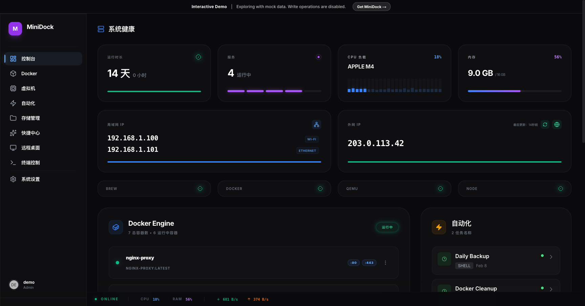
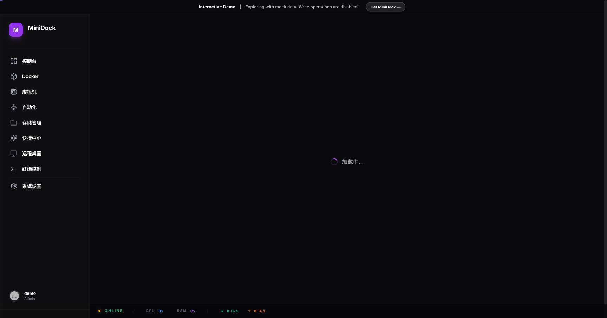
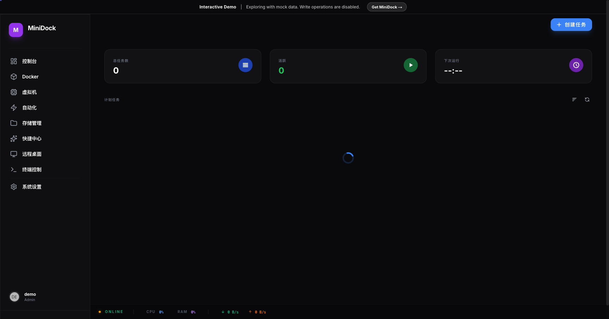
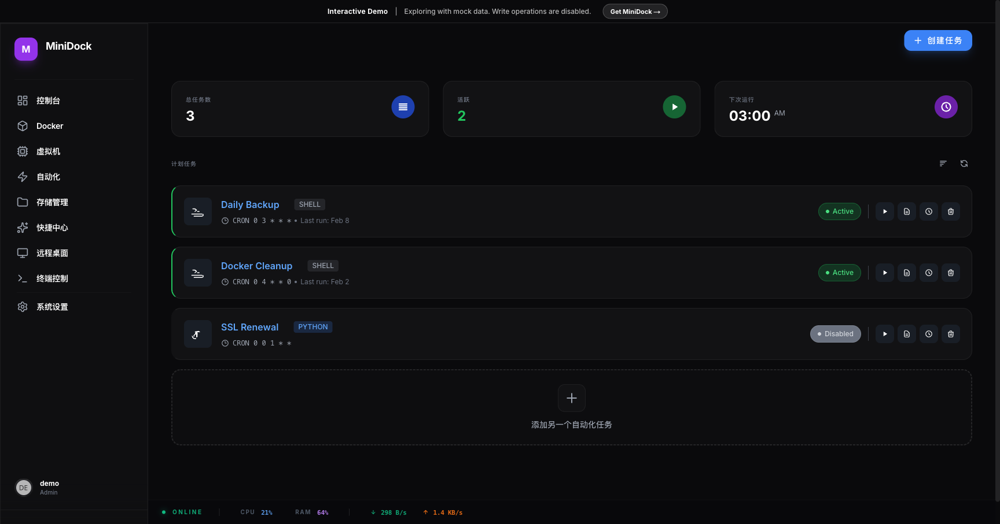

<div align="center">

# MiniDock

**将你的 Mac mini 打造成终极家用 NAS**

[](https://www.apache.org/licenses/LICENSE-2.0)
[](https://www.apple.com/macos/)
[](https://swift.org)
[](https://nextjs.org)

[English](README.md) | [简体中文](README.zh-CN.md)

[官方网站](https://minidock.net) • [文档](docs/) • [社区](https://github.com/ironlab-dev/minidock/discussions)



</div>

---

## 💡 痛点

你有一台闲置的 Mac mini，但搭建家用 NAS 却面临：
- 😫 **配置复杂** - 传统 NAS 系统需要大量配置
- 💸 **成本高昂** - 专用硬件动辄数千元
- 🔒 **功能受限** - 封闭生态限制你能做的事
- 🐌 **性能孱弱** - 弱 CPU 难以应对现代工作负载

## ✨ 解决方案

MiniDock 将你的 Mac mini 转变为**强大易用的家庭服务器**：
- 🎯 **一键安装** - 几分钟内完成安装，而非数小时
- 💪 **Apple Silicon 性能** - 充分利用 M 系列芯片的强大性能
- 🌐 **原生 macOS** - 在服务之外运行任何 macOS 应用
- 🎨 **精美界面** - 通过优雅的 Web 界面管理一切

---

## 🎯 什么是 MiniDock？

MiniDock 是一款**原生 macOS 应用**，将你的 Mac mini 转变为全面的家庭服务器平台。通过遵循 Apple 人机界面指南的优雅 Web 界面，管理 Docker 容器、虚拟机、自动化任务和系统资源。

### 🌟 核心功能

<table>
<tr>
<td width="50%">

#### 🐳 Docker 管理
- 完整的容器编排
- GitOps 工作流与版本控制
- 支持 ANSI 颜色的实时日志
- 端口映射和服务发现
- 一键模板部署

</td>
<td width="50%">

#### 💻 原生虚拟机
- 无头 QEMU/UTM 集成
- 无 GUI 开销或 Dock 图标
- 支持 Apple Silicon 和 Intel
- ISO 管理和存储控制
- VNC 控制台访问

</td>
</tr>
<tr>
<td width="50%">

#### 🤖 自动化引擎
- Cron 定时调度（分钟精度）
- 文件系统监控（FSEvents）
- Webhook 触发器
- 基于指标的触发（CPU/内存）
- Shell、Python 和 Swift 脚本

</td>
<td width="50%">

#### 🖥️ 远程桌面
- 基于浏览器的 VNC 访问
- 原生全屏支持
- 移动端触控友好
- 连接历史记录
- 无需第三方软件

</td>
</tr>
<tr>
<td width="50%">

#### 📁 文件管理器
- 安全的 Web 文件浏览器
- 内置代码编辑器（Vim 模式）
- 文件预览和编辑
- 路径验证和安全性
- 响应式设计

</td>
<td width="50%">

#### 🚀 启动编排
- 智能服务启动
- 依赖管理
- 延迟控制（毫秒精度）
- 状态检查
- 基于优先级的排序

</td>
</tr>
</table>

---

## 📸 截图

<div align="center">

### 控制台概览

*实时系统监控，采用精美的毛玻璃设计*

### Docker 管理

*通过 GitOps 工作流和实时日志管理容器*

### 虚拟机控制台

*通过基于浏览器的 VNC 访问虚拟机*

### 自动化任务

*创建强大的自动化工作流，支持多种触发器*

</div>

---

## 🆚 为什么选择 MiniDock？

<table>
<thead>
<tr>
<th width="25%">功能</th>
<th width="25%">传统 NAS</th>
<th width="25%">Docker Desktop</th>
<th width="25%">MiniDock</th>
</tr>
</thead>
<tbody>
<tr>
<td><strong>硬件成本</strong></td>
<td>❌ ¥3000-15000+</td>
<td>✅ 使用现有 Mac</td>
<td>✅ 使用现有 Mac</td>
</tr>
<tr>
<td><strong>安装时间</strong></td>
<td>❌ 数小时/数天</td>
<td>⚠️ 手动配置</td>
<td>✅ 几分钟</td>
</tr>
<tr>
<td><strong>虚拟机支持</strong></td>
<td>⚠️ 有限</td>
<td>❌ 无原生 VM</td>
<td>✅ 完整 QEMU/UTM</td>
</tr>
<tr>
<td><strong>自动化</strong></td>
<td>⚠️ 基础脚本</td>
<td>❌ 无</td>
<td>✅ 高级引擎</td>
</tr>
<tr>
<td><strong>Web 界面</strong></td>
<td>⚠️ 过时</td>
<td>❌ 仅桌面</td>
<td>✅ 现代响应式</td>
</tr>
<tr>
<td><strong>GitOps</strong></td>
<td>❌ 无</td>
<td>❌ 无</td>
<td>✅ 内置</td>
</tr>
<tr>
<td><strong>远程访问</strong></td>
<td>⚠️ 需要 VPN</td>
<td>❌ 无</td>
<td>✅ 内置 VNC</td>
</tr>
<tr>
<td><strong>性能</strong></td>
<td>❌ 弱 CPU</td>
<td>✅ 原生</td>
<td>✅ Apple Silicon</td>
</tr>
</tbody>
</table>

---

## 🚀 快速开始

### 系统要求

```
✅ macOS 14 (Sonoma) 或更高版本
✅ Apple Silicon 或 Intel Mac（推荐 Apple Silicon）
✅ 最低 8GB 内存（推荐 16GB+）
✅ 50GB 可用磁盘空间
```

### 安装

```bash
# 1. 克隆仓库
git clone https://github.com/ironlab-dev/minidock.git
cd minidock

# 2. 安装依赖（首次运行）
./setup.sh

# 3. 生成 Xcode 项目
brew install xcodegen
xcodegen generate

# 4. 构建并运行应用
./dev-app.sh
```

**就这么简单！** 🎉 应用将出现在菜单栏中。点击图标访问控制台：`http://localhost:23000`

### 开发者模式

```bash
# 开发模式（支持热重载）
./dev.sh

# 检查服务状态
./dev.sh status

# 停止所有服务
./stop.sh
```

---

## 🏗️ 架构

<div align="center">

```
┌─────────────────────────────────────────────────────────┐
│                  MiniDock macOS 应用                    │
│                                                         │
│  ┌───────────────────────────────────────────────────┐ │
│  │         Web UI (Next.js + React)                  │ │
│  │  • 毛玻璃设计（Apple HIG）                         │ │
│  │  • 实时 WebSocket 更新                            │ │
│  │  • 响应式（桌面 + 移动）                          │ │
│  └───────────────────────────────────────────────────┘ │
│                          ↕                              │
│  ┌───────────────────────────────────────────────────┐ │
│  │      后端 API (Swift + Vapor)                     │ │
│  │  • Async/await 并发                               │ │
│  │  • SQLite 数据库（Fluent ORM）                    │ │
│  │  • WebSocket 管理器                               │ │
│  └───────────────────────────────────────────────────┘ │
│                          ↕                              │
│  ┌─────────────┬─────────────┬─────────────┐          │
│  │   Docker    │    QEMU     │  Automation │          │
│  │   服务      │    服务     │    服务     │          │
│  ─────────┴─────────────┴─────────────┘          │
└─────────────────────────────────────────────────────────┘
                          ↕
        ┌─────────────────┴─────────────────┐
        │                                   │
   ┌────▼────┐                         ┌───▼────┐
   │ Docker  │                         │  QEMU  │
   │ 引擎    │                         │  虚拟机│
   │         │                         │        │
   │ • OrbStack                        │ • UTM  │
   │ • Docker Desktop                  │ • ISO  │
   │ • Colima                          │ • 磁盘 │
   └─────────┘                         └────────┘
```

</div>

### 技术栈

| 层级 | 技术 | 用途 |
|------|------|------|
| **后端** | Swift 6.0 + Vapor 4 | 原生性能、类型安全、async/await |
| **前端** | Next.js 14 + React 18 | 现代 UI、SSR、热重载 |
| **数据库** | SQLite + Fluent ORM | 轻量级、嵌入式、零配置 |
| **外壳** | Swift + Cocoa | 菜单栏应用、系统集成 |
| **样式** | Tailwind CSS | 实用优先、符合 Apple HIG |
| **实时** | WebSocket | 实时更新、系统指标 |

---

## 🎨 设计理念

MiniDock 遵循 **Apple 人机界面指南**，提供原生 macOS 体验：

- 🪟 **毛玻璃效果** - 背景模糊与半透明背景
- 🌙 **深色模式优先** - 针对暗色环境优化
- 🎯 **直接操作** - 点击标题编辑，拖拽重新排序
- 🔄 **静默刷新** - 后台更新无进度条
- ⚡ **微交互** - 流畅动画和即时反馈
- 📱 **响应式** - 在桌面和移动端都表现出色

---

## 📚 文档

- 📖 [安装指南](docs/installation.md) - 详细的安装说明
- 👤 [用户手册](docs/user-guide.md) - 完整的功能文档
- 💻 [开发者指南](docs/development.md) - 贡献和架构
- 🔌 [API 参考](docs/api.md) - REST API 文档
- ❓ [常见问题](docs/faq.md) - 常见问题解答

---

## 🤝 贡献

我们欢迎社区贡献！无论是修复 Bug、添加功能还是改进文档，你的帮助都很宝贵。

### 如何贡献

1. **Fork** 本仓库
2. **创建**功能分支 (`git checkout -b feature/amazing-feature`)
3. **提交**你的更改 (`git commit -m 'feat: add amazing feature'`)
4. **推送**到分支 (`git push origin feature/amazing-feature`)
5. **开启** Pull Request

### 开发指南

- 遵循 Swift 和 TypeScript 最佳实践
- 编写清晰的提交信息（Conventional Commits）
- 为新功能添加测试
- 根据需要更新文档
- UI 更改遵循 Apple HIG

详见 [CONTRIBUTING.md](CONTRIBUTING.md)。

---

## 🐛 Bug 报告 & 功能请求

发现 Bug 或有想法？我们很乐意听到你的声音！

- 🐞 **Bug 报告**: [创建 Issue](https://github.com/ironlab-dev/minidock/issues/new?template=bug_report.md)
- 💡 **功能请求**: [创建 Issue](https://github.com/ironlab-dev/minidock/issues/new?template=feature_request.md)
- 💬 **问题讨论**: [开始讨论](https://github.com/ironlab-dev/minidock/discussions)

---

## 📝 许可证

MiniDock 完全开源，采用 **Apache License 2.0**。

- ✅ 免费使用（个人和商业）
- ✅ 修改和分发
- ✅ 无需开源修改
- ✅ 审查每一行代码

详见 [LICENSE](LICENSE)。

### 支持开发

觉得 MiniDock 有用？可以考虑购买：
- **MiniDock Pro**（$19 一次性）：签名 .app + 自动更新
- **MiniDock Cloud**（$4.99/月）：远程访问 + AI 助手（即将推出）

[获取 MiniDock Pro →](https://minidock.net/pro)

---

## 🙏 致谢

MiniDock 站在巨人的肩膀上。特别感谢：

- [**Swift**](https://swift.org) - Apple 的现代、安全编程语言
- [**Vapor**](https://vapor.codes) - 服务端 Swift Web 框架
- [**Next.js**](https://nextjs.org) - 生产级 React 框架
- [**QEMU**](https://www.qemu.org) - 通用机器模拟器和虚拟化器
- [**noVNC**](https://novnc.com) - 使用 HTML5 的 VNC 客户端
- [**Tailwind CSS**](https://tailwindcss.com) - 实用优先的 CSS 框架

以及所有让这样的项目成为可能的优秀开源贡献者！🎉

---

## 📞 联系 & 支持

<div align="center">

### 获取帮助

| 渠道 | 链接 | 用途 |
|------|------|------|
| 🌐 **官网** | [minidock.net](https://minidock.net) | 官方网站和下载 |
| 📧 **邮箱** | minidock@ironlab.cc | 一般和支持 |
| 🐛 **Issues** | [GitHub Issues](https://github.com/ironlab-dev/minidock/issues) | Bug 报告和功能请求 |
| 💬 **讨论** | [GitHub Discussions](https://github.com/ironlab-dev/minidock/discussions) | 社区论坛和问答 |
| 📚 **文档** | [Documentation](docs/) | 指南和 API 参考 |

</div>

---

## 🌟 Star 历史

<div align="center">

[](https://star-history.com/#ironlab-dev/minidock&Date)

</div>

---

<div align="center">

### 由 [IronLab](https://ironlab.cc) 用 ❤️ 打造

**如果你觉得 MiniDock 有用，请考虑：**
- ⭐ **Star** 本仓库
- 🐦 **分享**给你的朋友
- 💬 **贡献**到项目
- ☕ **支持**我们的工作

---

**Copyright © 2026 IronLab. 保留所有权利。**

</div>
